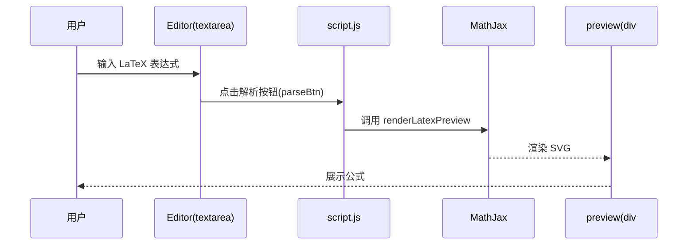
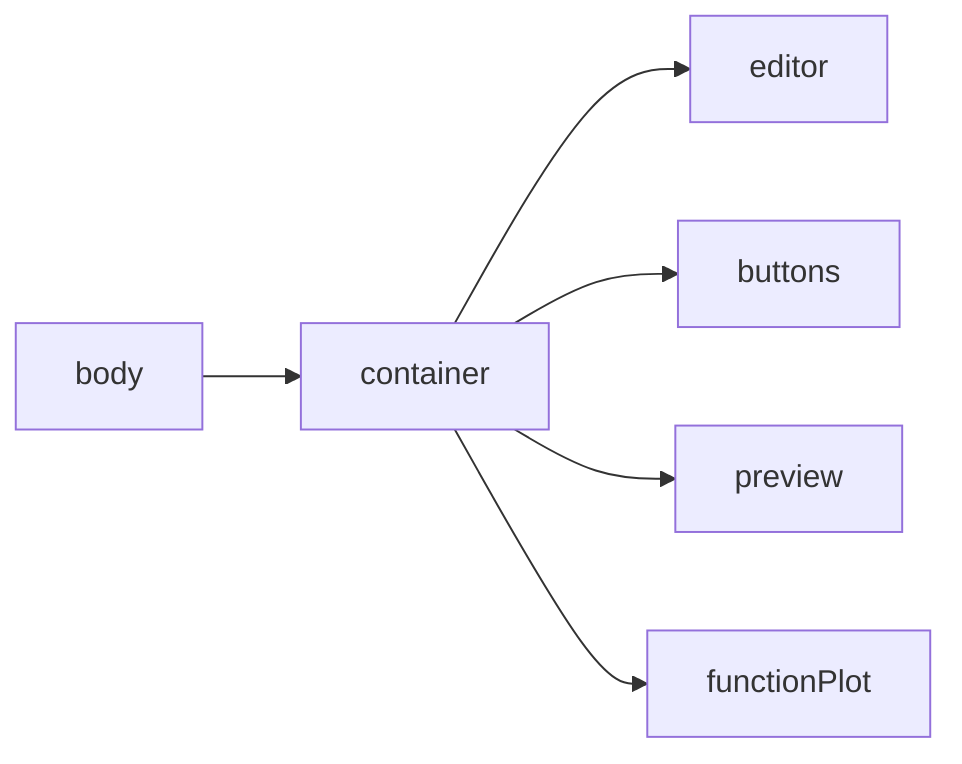
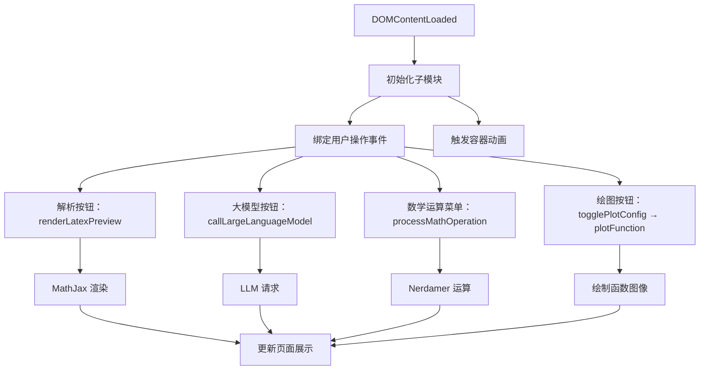
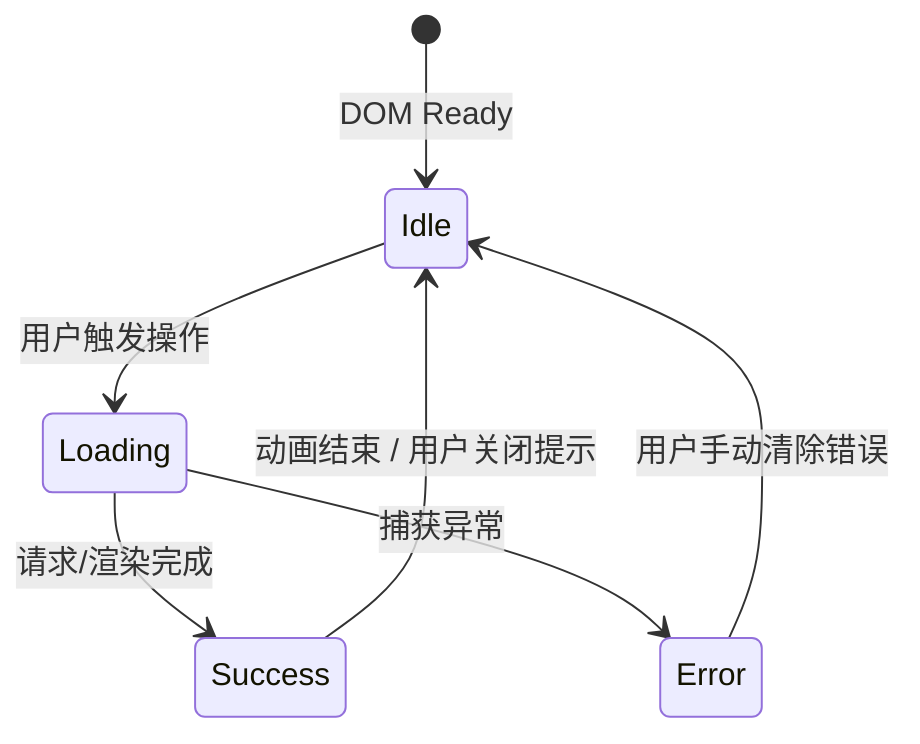

# 项目报告：LaTeX 编辑与解析
项目已部署上线： latex.lionspace.cn
## 1. 引言
- 本项目提供在线编辑与解析 LaTeX 数学表达式的能力  
- 功能涵盖：公式渲染、符号运算、函数绘图、调用大模型辅助解读  
- 目标：打造模块化、易扩展的前端工具  

## 2. 文件概览

- **index.html**
  - 功能：入口页面，包含 LaTeX 输入框、操作按钮和渲染预览容器。
  - 主要元素：`input#latex-input`, `button#render-btn`, `div#preview`。
- **style.css**
  - 功能：全局样式，包括布局、主题色和动画过渡。
  - 样式模块：输入区、按钮组和结果展示区。
- **dom.js**
  - 功能：封装常用 DOM 查询与事件绑定方法。
  - 核心函数：`getEl(selector)`、`on(el, event, handler)`。
- **config.js**
  - 功能：存储全局常量与 API 地址配置。
  - 配置项：`API_BASE_URL`、请求超时时间等。
- **script.js**
  - 功能：主事件注册与模块调用管理。
  - 工作流程：监听按钮点击→调用解析/运算/绘图/大模型模块。
- **mathjax.js**
  - 功能：MathJax 初始化与渲染封装。
  - 核心：`initMathJax()`、`renderLatex(latex, container)`。
- **math.js**
  - 功能：符号运算处理，依赖 Nerdamer 库。
  - 支持操作：求导、积分、化简等。
- **plot.js**
  - 功能：函数绘图，基于 function-plot 与 D3.js。
  - 流程：解析 LaTeX → 转换为 JavaScript 函数 → 渲染图表。
- **api.js**
  - 功能：与大模型接口通信。
  - 实现：请求构造、错误捕获、二次解释。
- **ui.js**
  - 功能：用户界面动态交互。
  - 特性：加载指示、提示信息、动画效果。

## 3. 源码解析

### 3.1 入口页面 (index.html)
- 加载资源顺序：
  1. MathJax 配置与 polyfill
  2. 引入 Bootstrap CSS 与 Animate.css
  3. Markdown-it、Nerdamer 系列、D3.js 和 function-plot
  4. 自定义样式和脚本
- 结构要点：
  - `<textarea id="editor">`：编辑区域，多行输入支持换行分隔多函数
  - 操作按钮：解析、调用大模型、数学运算下拉、绘图配置
  - `
`：MathJax 渲染输出区域
  - `
`：函数图像容器

### 3.2 全局样式 (style.css)
- 主题与布局：白底卡片式容器、圆角和阴影
- 编辑区与预览区样式：边框交互、动画过渡
- 函数绘图区：响应式 SVG 适配容器大小

### 3.3 DOM 工具 (dom.js)
dom.js 负责集中管理和导出页面中所有常用 DOM 元素引用，核心目的是减少重复查询、实现模块解耦并提高可维护性。

- 导出基础交互元素：
  - editor (`#editor`): 编辑区 `<textarea>`，输入 LaTeX 表达式
  - preview (`#preview`): 渲染预览区，用于展示 MathJax 渲染结果
  - parseBtn (`#parseBtn`): “解析” 按钮，触发表达式渲染
  - callModelBtn (`#callModelBtn`): 调用大模型按钮
  - modelQueryInput (`#modelQuery`): 模型查询输入框
  - mathOpsDropdown (`#mathOpsDropdown`): 数学运算类型下拉菜单
  - variableInput (`#variableInput`): 运算变量输入框
  - replaceEditorCheckbox (`#replaceEditorCheckbox`): 切换是否在编辑器中替换输入

- 导出函数绘图相关元素：
  - plotFunctionBtn (`#plotFunctionBtn`): 打开绘图配置面板按钮
  - plotConfigPanel (`#plotConfigPanel`): 绘图配置面板容器
  - functionPlotDiv (`#functionPlot`): 函数图像渲染容器
  - generatePlotBtn (`#generatePlotBtn`): 生成绘图按钮
  - closePlotConfigBtn (`#closePlotConfigBtn`): 关闭绘图配置面板按钮
  - xRangeMin / xRangeMax / yRangeMin / yRangeMax (`#xRangeMin` 等): 坐标范围输入框
  - showGridCheck / showLegendCheck (`#showGridCheck` / `#showLegendCheck`): 绘图选项复选框

- 优势与扩展：
  - 模块解耦：各功能模块可直接导入所需元素，无需显式 `document.get...` 操作
  - 集中管理：新增或修改 DOM 元素时仅需在此处更新，降低出错风险
  - 可扩展：后续可在本文件引入通用选择器函数或自定义指令，提升复用性

### 3.4 全局配置 (config.js)
- 存储 API 地址、模型名称和密钥
- 安全提醒：前端硬编码密钥风险，生产环境应移至后端或环境变量
- 可扩展：支持多环境切换（开发/测试/生产）

在项目启动时，`script.js` 作为应用的“大脑”负责模块初始化、事件绑定和整体流程协同。初始化阶段，脚本首先在 `DOMContentLoaded` 事件中导入并配置各子模块，包括全局配置（config.js）、DOM 操作（dom.js）、界面交互（ui.js）、LaTeX 渲染（mathjax.js）、大模型接口（api.js）、符号运算（math.js）和函数绘图（plot.js），确保各功能互不干扰且可按需加载。随后，通过统一的事件注册机制将用户操作映射到具体方法：点击“解析”按钮触发 MathJax 渲染，调用大模型按钮发起 LLM 请求，数学运算下拉菜单委托至对应处理函数，而绘图相关按钮则控制配置面板的显示与图像生成。为了增强用户体验，我们在初始化时加入容器动画，并在核心操作中采用输入校验与错误捕获，借助 `console.error` 及时报告异常，保障脚本在不同浏览器环境下依然保持稳定。

在本项目中，`math.js` 模块肩负将用户以 LaTeX 形式输入的数学表达式，转化为可计算对象并执行多种运算的重任。整个编写过程中，我们深刻体会到“类型安全”与“流程可控”对于前端数学运算的重要性。首先，通过 `nerdamer.convertFromLaTeX` 将输入的 LaTeX 字符串解析为 Nerdamer 表达式对象，这一步既保持了对数学符号的严格支持，又为后续统一操作打下基础。为了避免直接操作字符串带来的不可预期问题，我们统一将所有运算环节围绕该表达式对象展开，并在关键位置（如 `solveEquations` 返回值、`.toTeX()` 调用前后）插入日志与类型检查，确保异常能够被迅速捕获与定位。

在用户发起运算请求时，模块首先展示“正在执行”加载状态，然后进行空输入校验，防止无意义的函数调用。接着，根据操作类型（简化、求导、积分、因式分解、展开或求解方程）选择对应的 Nerdamer API。对于方程求解，额外处理了无解、多解和单解三种情形，并将结果格式化为 LaTeX 形式，保证预览输出直观易懂。在结果生成后，调用 `.toTeX()` 方法将内部对象转换回 LaTeX，再通过 MathJax 渲染到页面预览区域。若用户勾选“替换编辑器”选项，则还可一键将结果插入编辑器，提升交互体验。

考虑到前端环境下第 50 毫秒左右的渲染节奏，我们用 `setTimeout` 保证加载动画能及时展现。在错误处理方面，除了捕获所有可能的异常并在预览区域给出友好提示外，还利用后端大模型接口异步生成对错误原因的深入解释，帮助用户迅速理解并修正输入。这些设计经验启示我们：一方面要在关键路径精简操作以保障性能，另一方面需通过日志与类型检查构建可维护的“防火墙”，在复杂场景中依旧保持系统鲁棒。

### 3.5 函数绘图（plot.js）

函数绘图模块基于 function‑plot 与 D3.js，负责将用户以 LaTeX 表达式输入的函数转化为可交互的图像展现。其核心在于 parseLatexForPlotting 函数，其签名及参数如下：

- latexExpr：单个 LaTeX 函数表达式字符串。
- index：函数序号，用于从预定义颜色数组中循环选色。
- addLegend：是否在图例中展示函数标题。
- variableName：用户自定义的变量名，需替换为“x”以兼容绘图。

parseLatexForPlotting 的主要实现流程如下：

1. 检查 Nerdamer 库是否加载，保证 LaTeX 表达式能够被正确解析。
2. 使用 `nerdamer.convertFromLaTeX(latexExpr)` 将 LaTeX 转换为中间表达式，并调用 `toString()` 获取标准数学表达式字符串。
3. 若用户变量名不为 “x”，通过正则替换将所有自定义变量统一为 “x”，以兼容内置采样器。
4. 从颜色数组中根据 `index` 选取 `color`，并设置 `graphType`、`nSamples`（采样点数）和 `sampler`（内置采样器）等绘图参数。
5. 若 `addLegend` 为 `true`，在 `dataItem` 中添加 `title` 字段，以原始 LaTeX 表达式作为图例标签，提升可读性。
6. 将构造好的 `dataItem` 返回；若任一步骤抛出异常，则在 `catch` 块中捕获并重抛，携带原始 LaTeX 表达式，方便上层统一处理和用户提示。

在实际开发过程中，需关注 LaTeX 转换的边界情况、采样点数对性能和曲线平滑度的影响，以及配色和图例文本的显示效果。适当调整 `nSamples` 值可以在渲染性能与视觉体验之间取得平衡；错误处理则保证了模块的健壮性。

### 3.6 大模型接口（api.js）

大模型接口模块封装了与后端大模型服务的通信逻辑，负责请求构造、响应解析及错误处理，确保用户能获得及时且准确的文本解析和二次解释。模块的核心功能和设计思路如下：

- 请求构造
  - 从 `config.js` 中读取 `API_BASE_URL` 和模型名称等配置，使用 `fetch` 发起 POST 请求。
  - 请求体采用 JSON 格式，包含用户输入的 LaTeX 文本和操作类型等信息。
- 响应处理
  - 将服务端返回的 JSON 结果进行字段校验，提取核心内容（如解析结果或错误原因）。
  - 根据响应状态码进行分类处理：
    - 2xx：调用 `showPreviewMessage` 展示解析结果。
    - 4xx/5xx：抛出 Error 并在预览区显示友好错误提示。
- 异常捕获
  - 使用 `try…catch` 捕获网络错误及 JSON 解析异常，统一抛出自定义 Error，便于上层模块集中处理。
- 二次解释
  - 针对解析失败或计算错误的情况，额外调用大模型对错误原因进行深度解释，并将二次解释结果插入到预览区，提升用户调试效率。

模块设计原则：低耦合高内聚，通过统一的错误与日志 (`console.error`) 记录机制，实现请求与展示的解耦，保证前端界面在不同网络环境下的鲁棒性和可用性。

### 3.7 用户界面交互（ui.js）

用户界面交互模块包含一系列用于显示加载状态、提示信息和执行动画的通用方法，旨在提升操作反馈的及时性和页面响应的流畅度。主要函数包括：

- showLoadingMessageForElement(element, message)
  在指定 DOM 元素内部显示加载提示，并应用 Animate.css 动画类，以提示用户操作正在进行。
- showPreviewMessage(message)
  在预览区域插入提示信息，可用于成功消息、警告或错误提示，支持 HTML 内容传入。
- clearLoadingState(element)
  移除加载提示及相关动画，将元素恢复到初始状态。

模块通过对 `classList` 的操作与 `innerHTML` 的动态赋值，实现对 DOM 的最小化重排；并结合 `setTimeout` 或 CSS 动画结束事件，控制动画时序与状态切换，使得 UI 体验更自然流畅。

## 4. 使用说明
1. 在文本框输入 LaTeX 表达式  
2. 点击“解析LaTeX”查看公式预览  
3. 下拉选择数学运算并执行  
4. 点击“绘图”生成可交互曲线  
5. 调用大模型获取解析或错误解释  

## 5. 未来改进

未来版本将重点围绕功能扩展与性能优化展开。首先，考虑引入更多数学运算类型，例如矩阵运算、多元函数绘图和数值求解，以满足更复杂的学术和工程场景需求。其次，可在客户端增加本地缓存与离线渲染机制，通过 Service Worker 或 IndexedDB 缓存常用库与计算结果，实现即时响应并降低网络依赖。此外，可进一步优化绘图性能，例如动态调整采样点密度、异步计算与 Web Worker 分离主线程，保证界面流畅度。在用户界面方面，将提升交互友好性与可访问性，包括支持暗黑模式、可配置主题和键盘导航，以及增加结果导出（SVG/PNG/LaTeX）和可定制化的样式选项。

## 6. 结论

本项目成功实现了在线编辑、LaTeX 渲染、符号运算和函数绘图等核心功能，构建了从表达式解析到结果呈现的完整工作流程。模块化设计使各子系统低耦合高内聚，便于后续功能扩展与维护；合理的错误处理与加载提示提升了用户体验和系统稳健性。通过引入 MathJax、Nerdamer 和 function‑plot 等成熟库，兼顾了渲染质量与可交互性，为用户提供了高效、直观的数学学习和研究辅助工具。未来工作将继续迭代优化，以满足更广泛的使用场景和用户需求。
