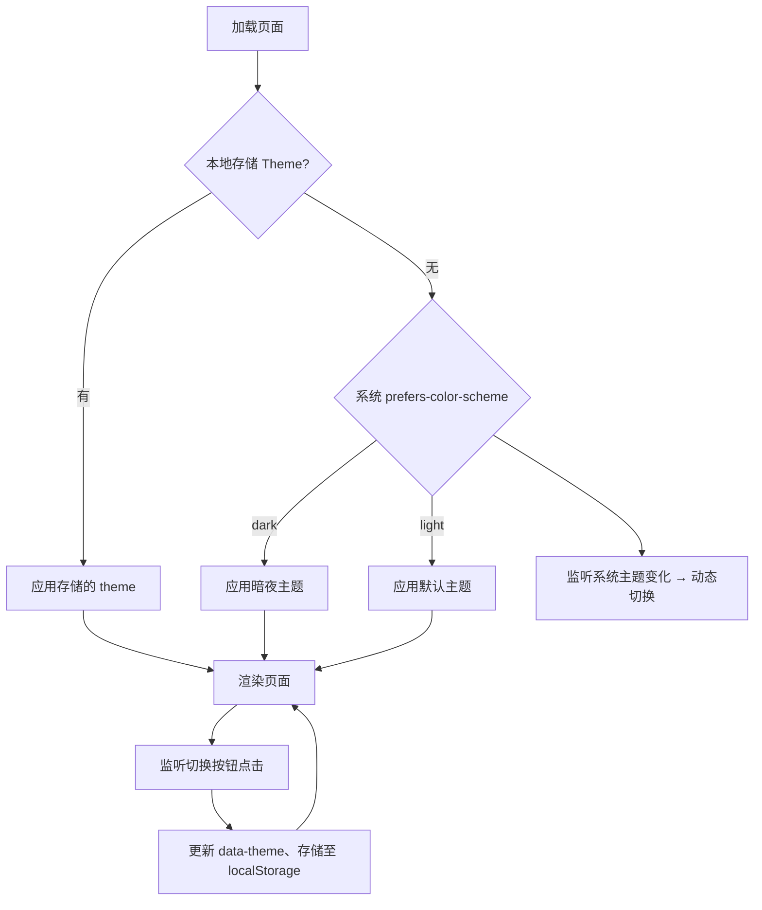

# 暗夜主题方案

## 方案流程

1. 统一定义 CSS 变量  
   - 在 `:root` 中声明颜色变量（背景、文字、边框等）  
   - 使用 `@media (prefers-color-scheme: dark)` 或 `[data-theme="dark"]` 覆盖变量  

2. 添加手动切换按钮  
   - 在 `index.html` 顶部插入切换开关（如“🌙/☀️”按钮）  

3. 实现脚本逻辑（`script.js`）  
   1. 页面初始化：  
      - 读取 `localStorage.theme`  
      - 若无，则使用 `window.matchMedia` 判断系统偏好  
      - 在 `<html>` 元素上设置 `data-theme="dark"` 或 `light`  
   2. 添加监听：  
      - 切换按钮 `click` → 切换主题、更新 `localStorage`  
      - `matchMedia('(prefers-color-scheme: dark)')` 变化 → 动态切换  

4. 补充样式（`style.css`）  
   - 将现有硬编码颜色替换为 CSS 变量  
   - 定制深色模式下各组件（按钮、输入框、卡片、图例等）配色  

请阅读并确认，之后即可按照方案实现暗夜主题。